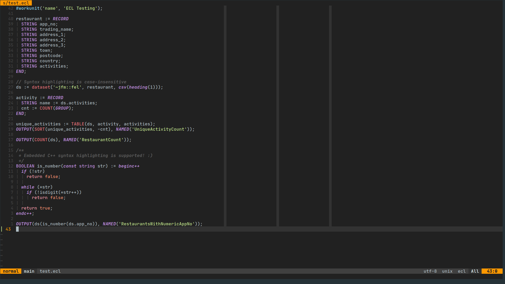
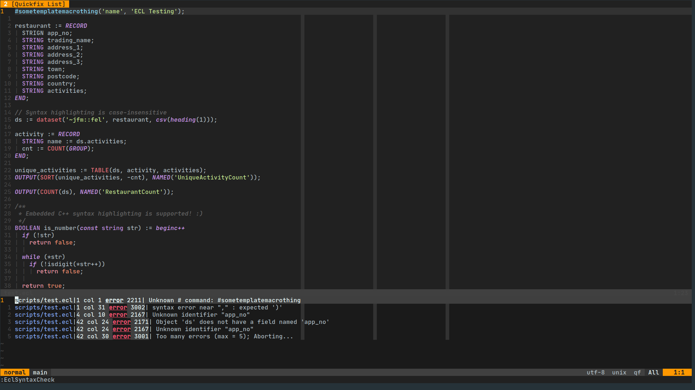
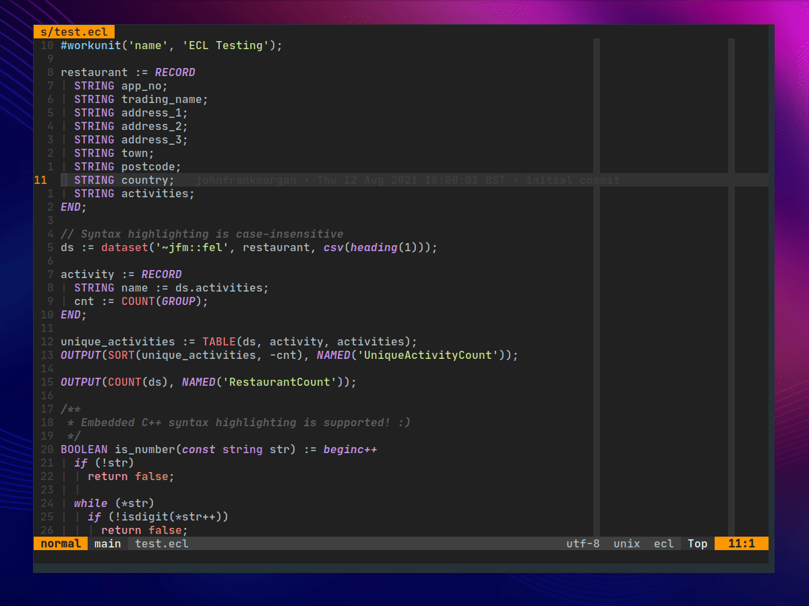
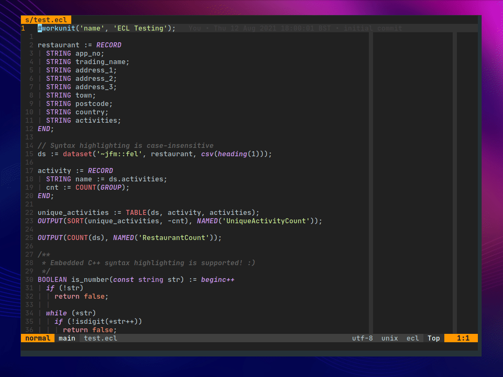

# ecl.nvim

This is a simple Neovim (`>= 0.5.0`) plugin to make writing ECL more pleasant. \
Most of the plugin isn't compatible with vanilla Vim, although the
[syntax highlighting file](syntax/ecl.vim) should work correctly.


## Installation

Install using your favourite plugin manager:

```lua
-- using packer.nvim
use {
  'johnfrankmorgan/ecl.nvim',
  config = function ()
    require('ecl').setup({
      -- configuration options and their default values

      -- cluster configuration is used to run ecl files
      cluster = {
        name = 'Local',               -- name (only used for display purposes)
        address = '127.0.0.1',        -- cluster's address or hostname
        username = os.getenv('USER'), -- username to use when authenticating (defaults to $USER)
        password = '',                -- password to use when authenticating (will prompt if empty)
      },

      -- ecl binary configuration
      ecl = {
        path = 'ecl',     -- ecl binary path (default finds it in $PATH)
        target = 'roxie', -- target to run against
        limit = 1000,     -- sets the limit when retrieving results
      },

      -- eclcc binary configuration
      eclcc = {
        path = 'eclcc',    -- eclcc binary path (default finds it in $PATH)
        log = '/dev/null', -- where to write log files to
      },
    })
  end,
}
```

Python 3 support is required to parse XML result sets. \
It can be installed using:

```bash
pip3 install neovim
```


## Features

### Syntax Highlighting

Syntax highlighting configuration is auto-generated using an XML file provided
by the [ECLIDE](https://github.com/hpcc-systems/eclide/blob/master/docs/LanguageRefECL.xml).




### Syntax Checking

Syntax checking can be performed in two ways:

```vim
" filename defaults to % (the current file)
EclSyntaxCheck <filename>
```
or
```lua
-- filename defaults to % (the current file)
require('ecl.syntax').check(<filename>)
```

The quickfix list will be populated with any errors.




### Running Queries

Queries can be run in two ways:

```vim
" filename defaults to % (the current file)
EclRun <filename>
```
or
```lua
-- filename defaults to % (the current file)
require('ecl.runner').run(<filename>)
```

Each result set will be drawn in a dedicated tab. \
To close all results, run `:EclCloseResults`.




### Completion

Basic dictionary completion is provided using the same file that's used to generate syntax highlighting. \
By default, `<C-x><C-k>` can be used to view completions.


